# diagramma flowchart: come fare un diagramma UML/mermaid
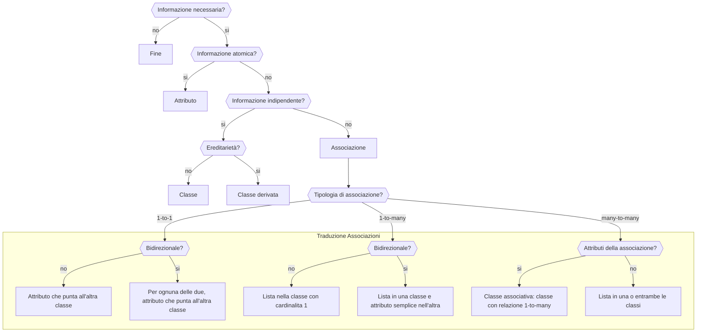

# Informatica Appunti 14/02/2025

## Associazioni

**1-n:** una lista nella classe principale e un attributo nell'altra.

Nelle associazioni, dipende dal verbo il senso dell'associazione (contiene, ecc.). Leggendo la cardinalità, posso capire dai due sensi come fare l'associazione.

**Esempio: tradurre VisitaVeterinaria da Animale**

- **1-n:** Un animale può avere più visite veterinarie.
- **n-1:** Una visita veterinaria può avere più animali.
- **n-n:** Un animale può avere più visite veterinarie e una visita veterinaria può avere più animali.

## Informatica Appunti 18/02/2025

### Classi semplici e derivate

- La relazione **N-N** va scomposta. Se si aggiungono informazioni, va fatta una classe in mezzo (classe associativa), altrimenti no.

- Se nella verifica aggiungo metodi in più, va bene.

### Esempio di verifica
- Devo restituire l'elenco dei docenti di una determinata materia.
  -stringa materia
  - lista docenti
- Devo capire la classe dove metterle (**in questo caso Scuola**).
- Devo calcolare l'età media dei docenti.
  - Si fa nella classe **Scuola**.
  - Metodo: `calcola_età_media_docenti() -> float`

### Relazioni tra classi
- **N-N** → Lista in due classi
  - Se c'è una classe in mezzo, vengono messi gli attributi delle due classi.

  - ` Scuola "1" -- "*" docente : lavora`
  - Se l'asterisco (`*`) è in basso → lista sopra, attributo semplice in basso.
  - Se l'asterisco (`*`) è in alto → attributo semplice sopra, lista in basso.
  - **Esempio di relazione:**
    - `Scuola → list<Docente> → Docenti`
    - `Docente → Scuola → Scuola`

### Metodi
- Partire dalla classe più semplice.
- Per verificare se qualcosa è booleano:
  - `attiva() -> None`
  - `disattiva() -> None`
  - `verificaStato() -> bool`

### Alcuni consigli per la verifica:

Inizia identificando le classi principali e le loro relazioni

Per ogni relazione, usa la giusta cardinalità (1-1, 1-n, n-n)

Ricorda di aggiungere gli attributi necessari per le associazioni

Aggiungi i metodi essenziali per la gestione delle relazioni

Usa le frecce appropriate:

--> per associazioni

<|-- per ereditarietà

..> per dipendenze

Le associazioni più comuni da implementare sono:

One-to-Many (1-*): usa una lista nella classe "uno" e un riferimento singolo nella classe "molti"

Many-to-Many (-): usa liste in entrambe le classi o crea una classe intermedia

One-to-One (1-1): usa riferimenti singoli in entrambe le classi

# Preparazione alla Verifica di Informatica

## Appunti

**1-n**: Una lista nella classe principale e un attributo nell'altra.

**Dipende dal verbo il senso dell'associazione (contiene, possiede, ecc.)**.

**Leggendo la cardinalità posso capire dai due sensi come fare l'associazione**:

- **1-n**: Un animale può avere più visite veterinarie.
- **n-1**: Una visita veterinaria può riguardare più animali.
- **n-n**: Un animale può avere più visite veterinarie e una visita veterinaria può riguardare più animali.

Esempio in **Mermaid**:

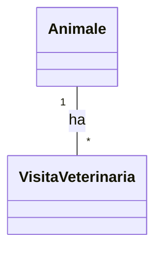

---

## Associazioni nelle Classi

Le associazioni tra classi si classificano in diverse tipologie:

### Associazione 1-1

Un utente può avere un solo profilo e ogni profilo appartiene a un solo utente.

- In questo caso, ogni classe contiene un riferimento diretto all'altra classe.

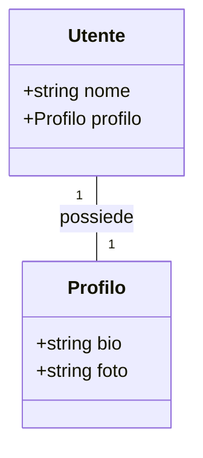

### Associazione 1-N

Un autore può scrivere più libri, ma ogni libro ha un solo autore.

- La classe con cardinalità "1" avrà una lista degli oggetti della classe con cardinalità "N".
- La classe con cardinalità "N" avrà un riferimento singolo all'oggetto della classe con cardinalità "1".

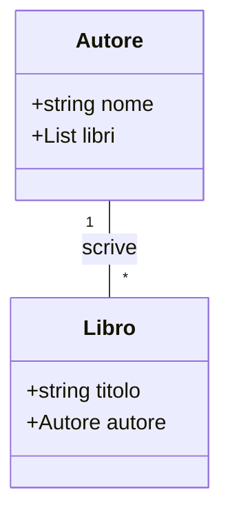

### Associazione N-N

Uno studente può essere iscritto a più corsi, e ogni corso può avere più studenti iscritti.

- Entrambe le classi contengono una lista degli oggetti dell'altra classe.

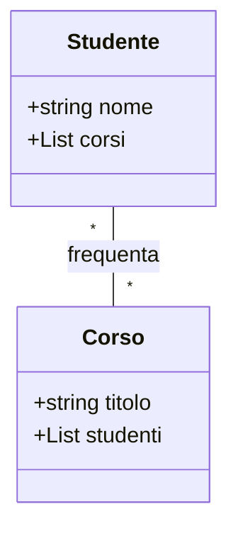

### Associazione con Classe Associativa

Un dottore può visitare più pazienti e un paziente può avere più visite. Creiamo una classe **Visita** che raccoglie informazioni aggiuntive come la data della visita.

- La classe intermedia "Visita" rappresenta la relazione e contiene riferimenti alle altre due classi.

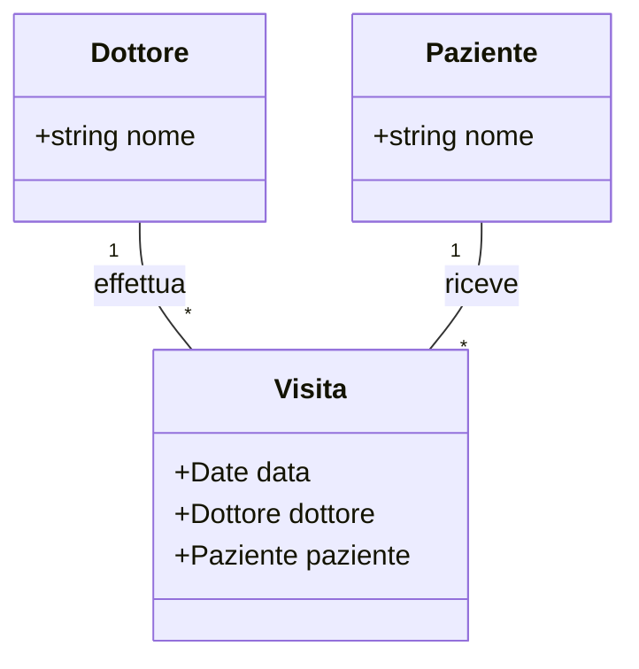

### Associazione con Ereditarietà

Una persona può essere uno studente o un docente. Definiamo una classe "Persona" e due classi derivate "Studente" e "Docente".

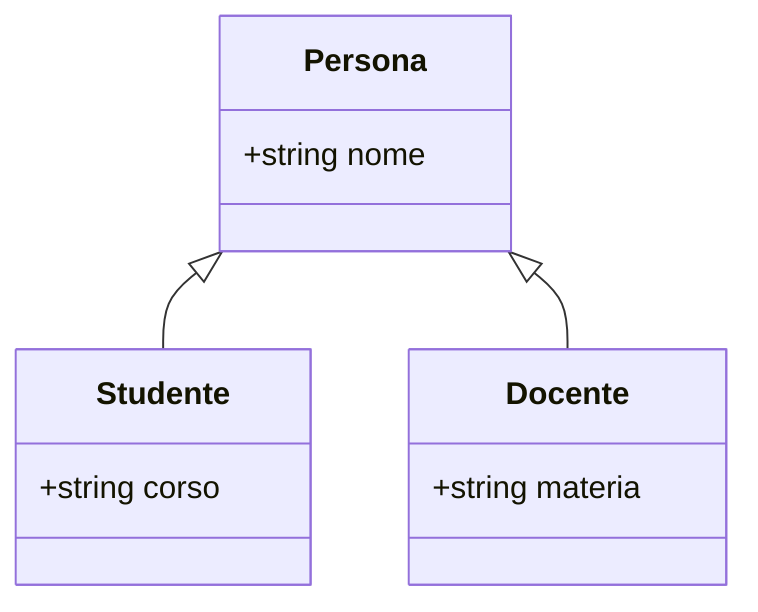

---

## Verifica precendente
# Diagramma UML del Sistema Gestione Zoo

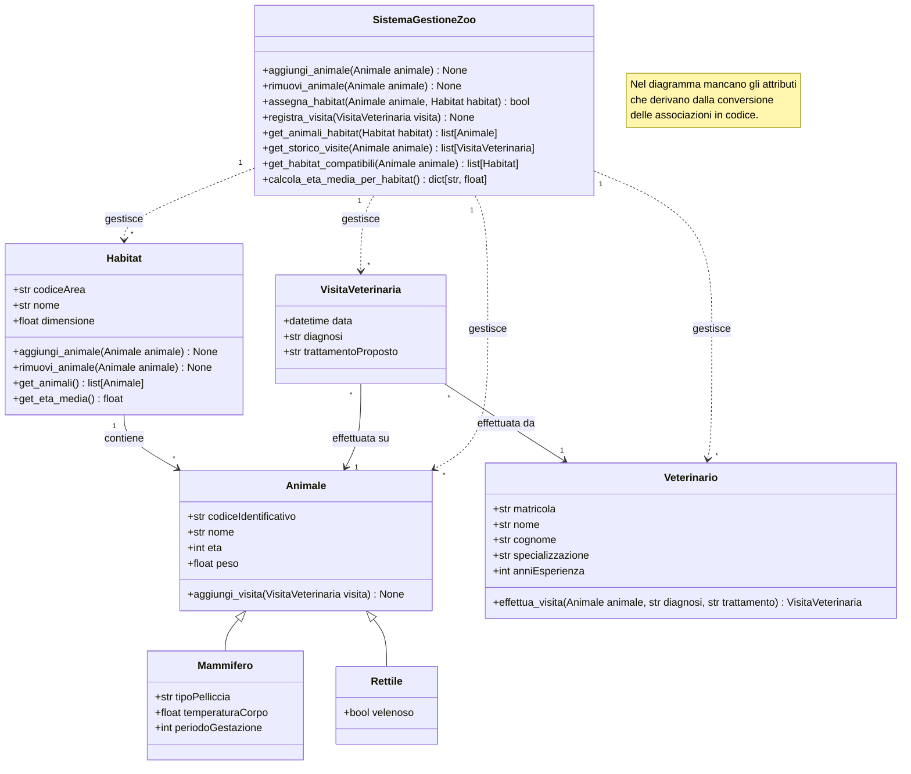

# esercizio in preparazione alla verifica

# testo esercizio
### Serra automatizzata

Un'azienda agricola moderna vuole automatizzare la gestione della propria serra. Ogni serra viene utilizzata per diverse coltivazioni e deve essere monitorata costantemente. Per garantire la crescita ottimale delle _piante_, vengono utilizzati vari dispositivi e sensori che controllano le condizioni ambientali.

Le serre sono divise in sezioni separate per ospitare colture diverse che richiedono condizioni specifiche. _Il sistema deve tenere traccia di cosa viene coltivato, quando è stato piantato e quando si prevede il raccolto. Per ogni coltivazione, si deve poter calcolare lo stadio di crescita e stimare la quantità prevista al raccolto._

I vari dispositivi presenti nella serra (come irrigatori, ventilatori, luci) possono essere attivati o disattivati. I sensori forniscono continuamente letture delle condizioni ambientali attraverso un metodo di rilevazione.

_Il sistema deve essere in grado di intervenire automaticamente su una determinata sezione quando necessario, monitorando i parametri ambientali di tutta la serra (attraverso il metodo monitoraParametri che restituisce un dizionario con i valori rilevati) e attivando l'irrigazione (tramite il metodo attivaIrrigazione che attiva tutti i dispositivi di tipo irrigatore presenti nella sezione specificata)_.

# esercizio svolto

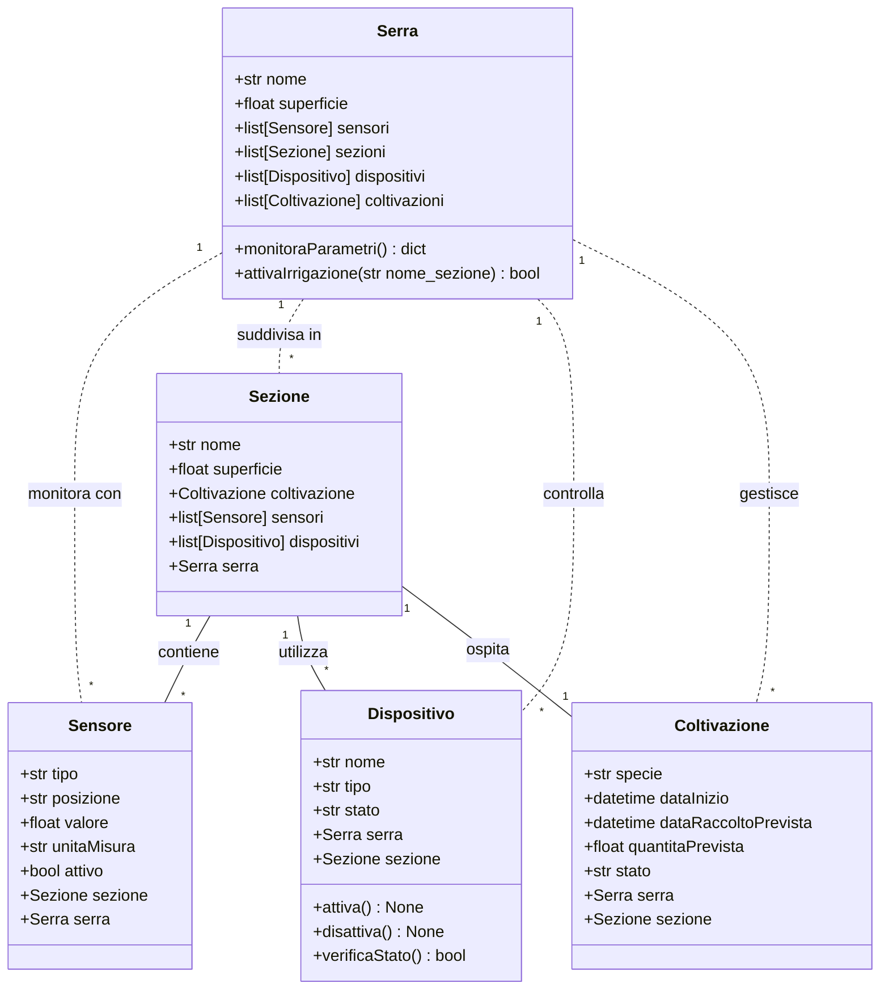

Spiegazione Passo-Passo

Identificazione delle Classi:

Serra: Contiene più sezioni e ha metodi per monitorare i parametri e attivare l'irrigazione.

Sezione: Contiene informazioni sulle colture e ha metodi per calcolare la crescita e stimare il raccolto.

Dispositivo: Può essere acceso o spento.

Sensore: Misura parametri ambientali e restituisce il valore rilevato.

Definizione delle Relazioni:

Una serra contiene più sezioni.

Ogni sezione ha più dispositivi e sensori.

Metodi Importanti:

monitoraParametri(): Restituisce i valori ambientali rilevati dai sensori.

attivaIrrigazione(id_sezione): Attiva tutti gli irrigatori in una specifica sezione.

calcolaStadioCrescita(): Determina lo stato attuale della coltivazione.

stimaRaccolto(): Fornisce una stima della quantità di raccolto attesa.

attiva() e disattiva(): Controllano i dispositivi.

rileva(): Restituisce il valore misurato da un sensore.

Con questo esercizio hai un esempio chiaro di modellazione di un sistema con classi e relazioni, utile per la verifica!

# Esercizio Svolto: Sistema di Gestione di una Biblioteca

#### Testo dell'esercizio

Una biblioteca moderna vuole automatizzare la gestione del proprio catalogo e del prestito dei libri. Ogni biblioteca possiede un ampio archivio di libri disponibili per il prestito.

I libri possono essere presi in prestito dagli utenti, i quali devono registrarsi nel sistema. Ogni utente può prendere in prestito più libri contemporaneamente, ma ogni libro può essere prestato a un solo utente alla volta.

Il sistema deve tenere traccia di chi ha preso in prestito un determinato libro e della data di scadenza del prestito. Deve inoltre permettere di verificare la disponibilità di un libro e segnalare i ritardi nei prestiti.

### Soluzione con Diagramma UML in **Mermaid**

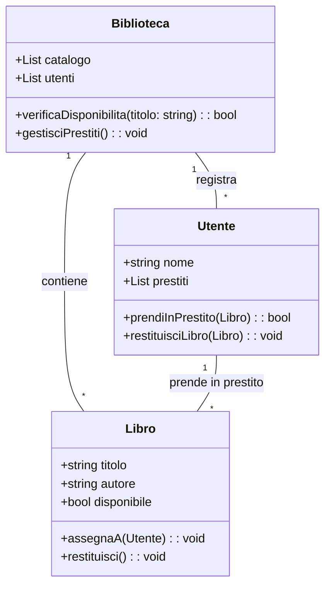

#### Spiegazione Passo-Passo

1. **Identificazione delle Classi**:
   - **Biblioteca**: Contiene una lista di libri e utenti registrati, con metodi per verificare la disponibilità e gestire i prestiti.
   - **Libro**: Contiene titolo, autore e stato di disponibilità, con metodi per assegnare il libro a un utente o restituirlo.
   - **Utente**: Ha un elenco di libri in prestito e metodi per prendere in prestito o restituire un libro.

2. **Definizione delle Relazioni**:
   - Una **biblioteca** contiene più **libri** e più **utenti**.
   - Un **utente** può prendere in prestito più **libri**, ma ogni **libro** può essere assegnato a un solo **utente** alla volta.

3. **Metodi Importanti**:
   - `verificaDisponibilita(titolo)`: Controlla se un libro è disponibile nel catalogo.
   - `gestisciPrestiti()`: Verifica lo stato dei prestiti e segnala ritardi.
   - `assegnaA(utente)`: Assegna un libro a un utente se disponibile.
   - `restituisci()`: Rende nuovamente disponibile un libro.
   - `prendiInPrestito(libro)`: Permette a un utente di prendere in prestito un libro disponibile.
   - `restituisciLibro(libro)`: Permette a un utente di restituire un libro in prestito.

# Metodi nelle Classi

I metodi rappresentano le operazioni che una classe può eseguire. Possono essere semplici o più complessi.

### Metodi di Accesso
- **getNome()**: Restituisce il nome di un oggetto.

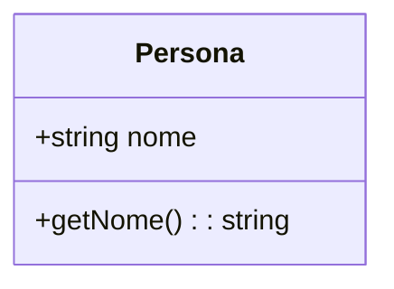

### Metodi di Calcolo
- **calcolaMediaVoti()**: Restituisce la media dei voti di uno studente.

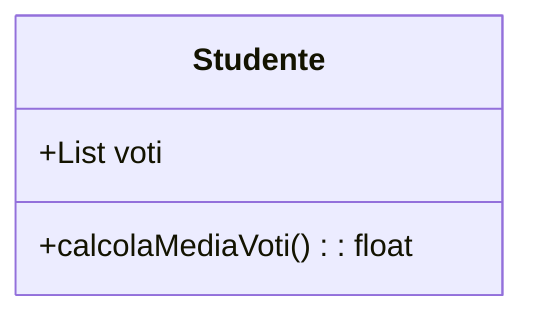

### Metodi Booleani
- **haSuperatoEsame()**: Restituisce `true` se il voto è sopra la soglia di sufficienza.

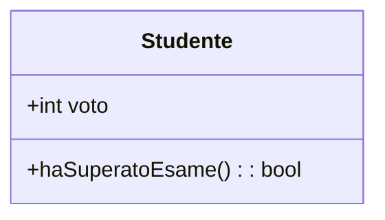

### Metodi con Parametri
- **aggiungiLibro(Libro libro)**: Aggiunge un libro alla lista di un autore.

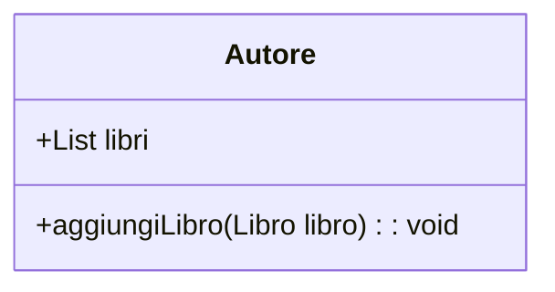

### Metodi di Gestione
- **attivaDispositivo()** e **disattivaDispositivo()**: Cambiano lo stato di un dispositivo.

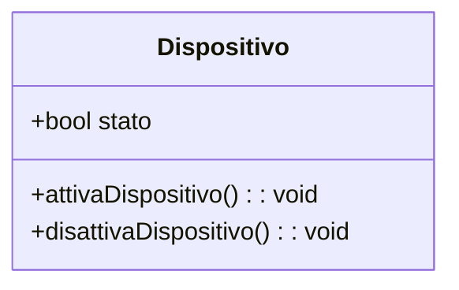

### Metodi Complessi
- **prenotaVisita(Paziente paziente, Date data)**: Permette a un dottore di prenotare una visita per un paziente.

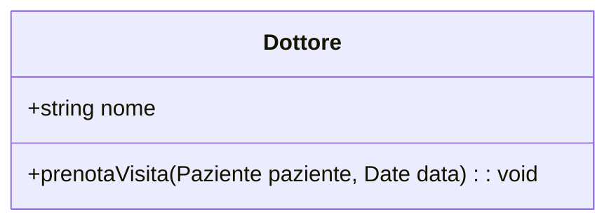

- **verificaDisponibilitaLibro(String titolo)**: Controlla se un libro è disponibile nella biblioteca.

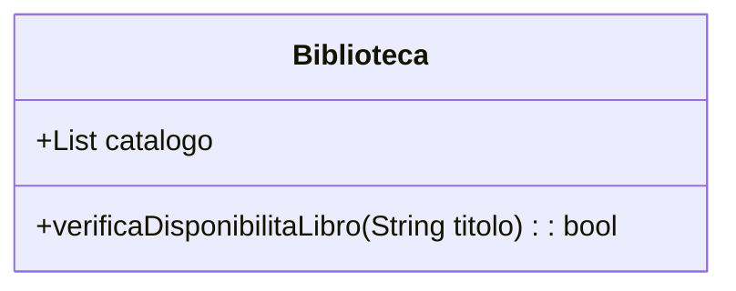

- **generaReportPresenze()**: Un corso può generare un report degli studenti iscritti.

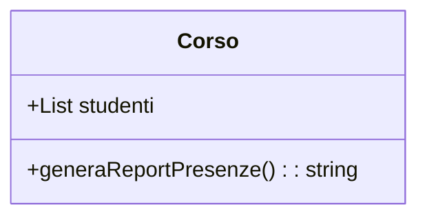

Con questi esempi hai una guida completa su come interpretare e progettare i metodi nelle classi UML!

