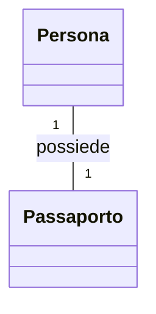
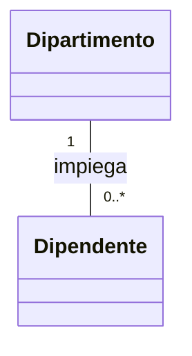
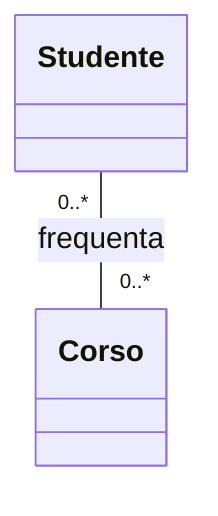
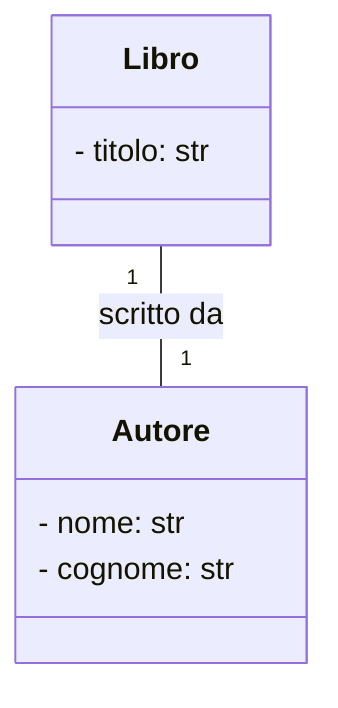
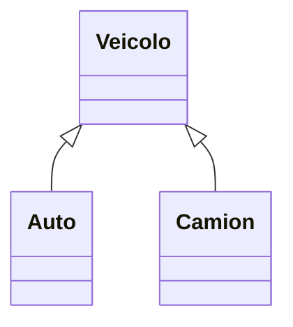
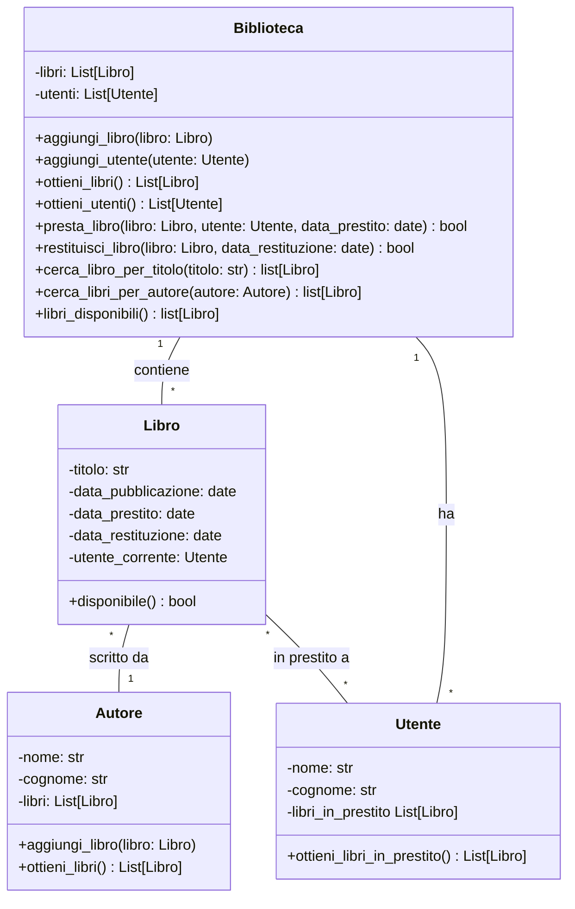
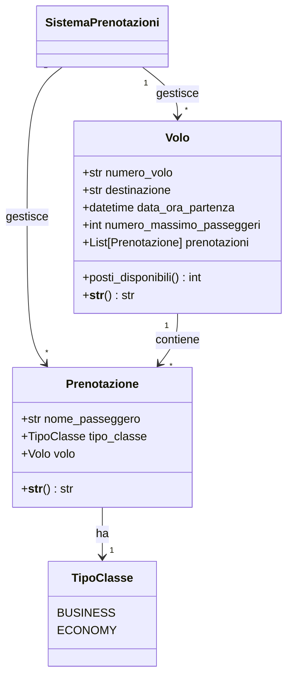
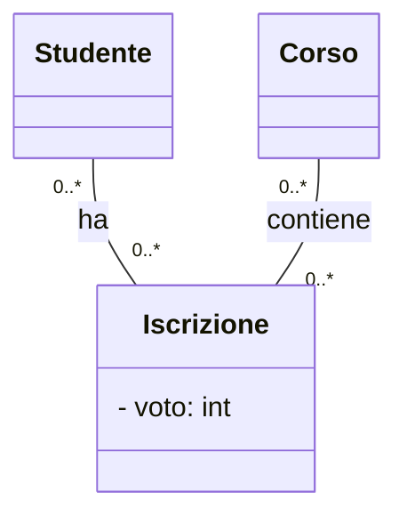
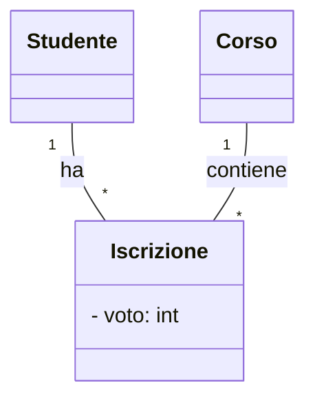
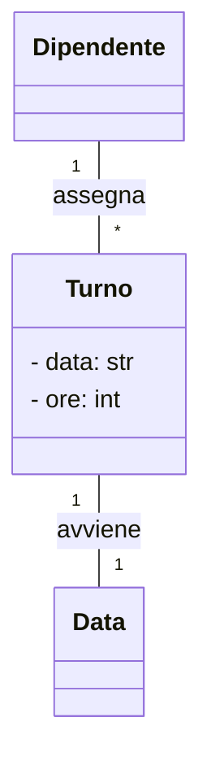

# Schemi per la Verifica di Informatica

## Associazioni e la loro Implementazione in Python

### Associazione Uno a Uno

**Esempio UML:**


**Implementazione Python:**
```python
class Passaporto:
    def __init__(self, numero):
        self.numero = numero
        self.proprietario = None

class Persona:
    def __init__(self, nome):
        self.nome = nome
        self.passaporto = None

    def assegna_passaporto(self, passaporto):
        self.passaporto = passaporto
        passaporto.proprietario = self
```
**Spiegazione:** La classe principale è `Persona`, che possiede un `Passaporto`. Il passaporto esiste solo se è associato a una persona.

---

### Associazione Uno a Molti

**Esempio UML:**


**Implementazione Python:**
```python
class Dipartimento:
    def __init__(self, nome):
        self.nome = nome
        self.dipendenti = []
    
    def aggiungi_dipendente(self, dipendente):
        self.dipendenti.append(dipendente)
        dipendente.dipartimento = self

class Dipendente:
    def __init__(self, nome):
        self.nome = nome
        self.dipartimento = None
```
**Spiegazione:** Il `Dipartimento` è la classe principale, che contiene più `Dipendente`. Ogni dipendente appartiene a un solo dipartimento.

---

### Associazione Molti a Molti

**Esempio UML:**


**Implementazione Python (corretta con liste bidirezionali):**
```python
class Studente:
    def __init__(self, nome):
        self.nome = nome
        self.corsi = []
    
    def iscrivi_a_corso(self, corso):
        if corso not in self.corsi:
            self.corsi.append(corso)
            corso.studenti.append(self)

class Corso:
    def __init__(self, nome):
        self.nome = nome
        self.studenti = []
```
**Spiegazione:** Ogni `Studente` può frequentare più `Corso`, e viceversa. Si utilizzano liste per gestire la relazione.

**Implementazione Python (con attributi aggiuntivi, classe intermedia corretta):**
```python
class Iscrizione:
    def __init__(self, studente, corso, voto):
        self.studente = studente
        self.corso = corso
        self.voto = voto

class Studente:
    def __init__(self, nome):
        self.nome = nome
        self.iscrizioni = []
    
    def iscrivi_a_corso(self, corso, voto):
        iscrizione = Iscrizione(self, corso, voto)
        self.iscrizioni.append(iscrizione)
        corso.iscrizioni.append(iscrizione)

class Corso:
    def __init__(self, nome):
        self.nome = nome
        self.iscrizioni = []
```
**Spiegazione:** La classe `Iscrizione` gestisce la relazione molti-a-molti tra `Studente` e `Corso`, permettendo di aggiungere attributi aggiuntivi come il voto.

---

## Spiegazione del Diagramma di Flusso del Professore

Il diagramma di flusso aiuta a decidere come tradurre un concetto in Python:

- **Se è un'informazione atomica**, diventa un **attributo** della classe.
- **Se è un'informazione indipendente**, diventa una **classe** separata.
- **Se esiste una relazione tra classi**, si usa un'associazione (1-1, 1-molti, molti-molti).
- **Se la relazione ha attributi**, si utilizza una **classe intermedia**.

### Come distinguere un'informazione atomica da una indipendente

**Esempio dal testo della verifica:**
- **Titolo di un libro** → è un'informazione atomica, quindi sarà un attributo della classe `Libro`.
- **Autore di un libro** → è un'entità indipendente, quindi diventa una classe separata `Autore`.

**Esempio UML:**


**Implementazione Python:**
```python
class Autore:
    def __init__(self, nome, cognome):
        self.nome = nome
        self.cognome = cognome

class Libro:
    def __init__(self, titolo, autore):
        self.titolo = titolo
        self.autore = autore
```

### Altre casistiche con UML e codice

**Ereditarietà:**

**Python:**
```python
class Veicolo:
    def __init__(self, targa, marca):
        self.targa = targa
        self.marca = marca

class Auto(Veicolo):
    def __init__(self, targa, marca, posti):
        super().__init__(targa, marca)
        self.posti = posti
```

### Esempio completo


**Python:**

from datetime import date
```python

class Biblioteca:
    def __init__(self):
        self.libri = []
        self.utenti = []
    
    def ottieni_libri(self):
        return self.libri
    
    def ottieni_utenti(self):
        return self.utenti
    
    def aggiungi_libro(self, libro):
        self.libri.append(libro)
    
    def aggiungi_utente(self, utente):
        self.utenti.append(utente)
    
    def libri_disponibili(self):
        libri_disponibili = []
        for libro in self.libri:
            if libro.disponibile is True:
                libri_disponibili.append(libro)
        return libri_disponibili
    
    def presta_libro(self, libro, utente, date):
        libro.disponibile = False
        libro.data_prestito = date
        libro.utente_corrente = utente
        utente.libri_in_prestito.append(libro)
    
    def restituisci_libro(self, libro, date):
        libro.disponibile = True
        libro.data_restituzione = date
        libro.utente_corrente.libri_in_prestito.remove(libro)
        libro.utente_corrente = None
    
    def cerca_libri_per_autore(self, autore):
        libri_autore = []
        for libro in self.libri:
            if libro.autore == autore:
                libri_autore.append(libro)
        return libri_autore
    
    def cerca_libro_per_titolo(self, titolo):
        libri_titolo = []
        for libro in self.libri:
            if titolo in libro.titolo:
                libri_titolo.append(libro)
        return libri_titolo
                

class Libro:
    def __init__(self, titolo, data_pubblicazione, autore):
        self.titolo = titolo
        self.data_pubblicazione = data_pubblicazione
        self.autore = autore
        autore.libri.append(self)
        self.data_prestito = None
        self.data_restituzione = None
        self.utente_corrente = None
        self.disponibile = True
    
    def __str__(self):
        return f"{self.titolo} ({self.autore})"

class Utente:
    def __init__(self, nome, cognome):
        self.nome = nome
        self.cognome = cognome
        self.libri_in_prestito = []
    
    def ottieni_libri_in_prestito(self):
        return self.libri_in_prestito
    
    def __str__(self):
        return f"{self.nome} {self.cognome}"

class Autore:
    def __init__(self, nome, cognome):
        self.nome = nome
        self.cognome = cognome
        self.libri = []

    def ottieni_libri(self):
        return self.libri
    
    def aggiungi_libro(self, libro):
        libro.append(self.libri)
        libro.autore = self
    
    def __str__(self):
        return f"{self.nome} {self.cognome}"
    
    def ottieni_libri(self):
        return(self.libri)
```
**Spiegazione: La classe Biblioteca gestisce l'aggiunta di libri e utenti, il prestito e la restituzione dei libri.**

## Casistica: Sistema di Prenotazioni di Voli

**Esempio UML:**


**Implementazione Python:**
```python
from datetime import datetime
from enum import Enum

class TipoClasse(Enum):
    BUSINESS = "Business"
    ECONOMY = "Economy"

class Volo:
    def __init__(self, numero_volo, destinazione, data_ora_partenza, numero_massimo_passeggeri):
        self.numero_volo = numero_volo
        self.destinazione = destinazione
        self.data_ora_partenza = data_ora_partenza
        self.numero_massimo_passeggeri = numero_massimo_passeggeri
        self.prenotazioni = []
    
    def posti_disponibili(self):
        return self.numero_massimo_passeggeri - len(self.prenotazioni)
    
    def __str__(self):
        return f"Volo {self.numero_volo} per {self.destinazione} ({self.data_ora_partenza})"

class Prenotazione:
    def __init__(self, nome_passeggero, tipo_classe, volo):
        self.nome_passeggero = nome_passeggero
        self.tipo_classe = tipo_classe
        self.volo = volo
        volo.prenotazioni.append(self)
    
    def __str__(self):
        return f"Prenotazione per {self.nome_passeggero} ({self.tipo_classe.value}) sul volo {self.volo.numero_volo}"
```
**Spiegazione:**
- `TipoClasse` è una enumerazione per rappresentare i tipi di classe disponibili.
- `Volo` contiene le informazioni di un volo e gestisce le prenotazioni.
- `Prenotazione` collega un passeggero a un volo specifico, con un tipo di classe associato.

Questa casistica mostra come gestire un sistema di prenotazioni in modo scalabile.


### Associazione Molti a Molti

**Esempio UML:**
```mermaid
direction LR
classDiagram
    Studente "0..*" -- "0..*" Corso : frequenta
```

**Implementazione Python (con liste bidirezionali):**
```python
class Studente:
    def __init__(self, nome):
        self.nome = nome
        self.corsi = []
    
    def iscrivi_a_corso(self, corso):
        self.corsi.append(corso)
        corso.studenti.append(self)

class Corso:
    def __init__(self, nome):
        self.nome = nome
        self.studenti = []
```
**Spiegazione:** Ogni `Studente` può frequentare più `Corso`, e viceversa. Si utilizzano liste per gestire la relazione.

### Associazione Molti a Molti con Attributi Aggiuntivi

**Esempio UML:**


**Implementazione Python:**
```python
class Iscrizione:
    def __init__(self, studente, corso, voto):
        self.studente = studente
        self.corso = corso
        self.voto = voto
        studente.iscrizioni.append(self)
        corso.iscrizioni.append(self)

class Studente:
    def __init__(self, nome):
        self.nome = nome
        self.iscrizioni = []
    
    def iscrivi_a_corso(self, corso, voto):
        iscrizione = Iscrizione(self, corso, voto)
        self.iscrizioni.append(iscrizione)

class Corso:
    def __init__(self, nome):
        self.nome = nome
        self.iscrizioni = []
```
**Spiegazione:** Quando un `Studente` si iscrive a un `Corso`, si crea un'istanza di `Iscrizione` che contiene l'informazione aggiuntiva del voto.

### Associazione Molti a Molti Convertita in Due Uno a Molti

**Esempio UML:**


**Implementazione Python:**
```python
class Iscrizione:
    def __init__(self, studente, corso, voto):
        self.studente = studente
        self.corso = corso
        self.voto = voto
        corso.studenti.append(studente)
        studente.corsi.append(corso)
        studente.iscrizioni.append(self)
        corso.iscrizioni.append(self)

class Studente:
    def __init__(self, nome):
        self.nome = nome
        self.corsi = []
        self.iscrizioni = []
    
    def iscrivi_a_corso(self, corso, voto):
        iscrizione = Iscrizione(self, corso, voto)
        self.iscrizioni.append(iscrizione)

class Corso:
    def __init__(self, nome):
        self.nome = nome
        self.studenti = []
        self.iscrizioni = []
```
**Spiegazione:** La relazione molti-a-molti tra `Studente` e `Corso` è stata convertita in due relazioni uno-a-molti attraverso la classe intermedia `Iscrizione`. Ora, ogni `Studente` ha una lista di `Iscrizioni` e ogni `Corso` contiene riferimenti agli studenti iscritti.

### Associazione Molti a Molti con Classe Associativa e Relazione Temporale

**Esempio UML:**


**Implementazione Python:**
```python
class Turno:
    def __init__(self, dipendente, data, ore):
        self.dipendente = dipendente
        self.data = data
        self.ore = ore
        dipendente.turni.append(self)

class Dipendente:
    def __init__(self, nome):
        self.nome = nome
        self.turni = []
    
    def assegna_turno(self, data, ore):
        turno = Turno(self, data, ore)
        self.turni.append(turno)
```
**Spiegazione:** La classe `Turno` funge da classe intermedia e permette di associare un dipendente a più turni lavorativi con un riferimento alla data e alle ore lavorate.

Queste implementazioni coprono diversi tipi di associazioni molti-a-molti, inclusi casi con attributi aggiuntivi, conversione in due relazioni uno-a-molti e relazioni temporali.


**Conclusione:**
Seguendo il diagramma del professore, possiamo identificare rapidamente come modellare una situazione in Python, garantendo una struttura chiara e mantenibile del codice.

